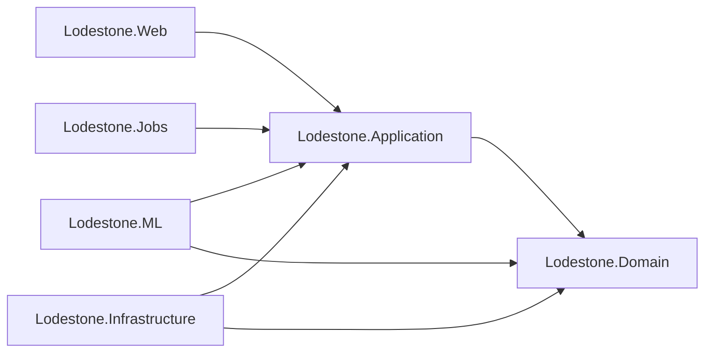
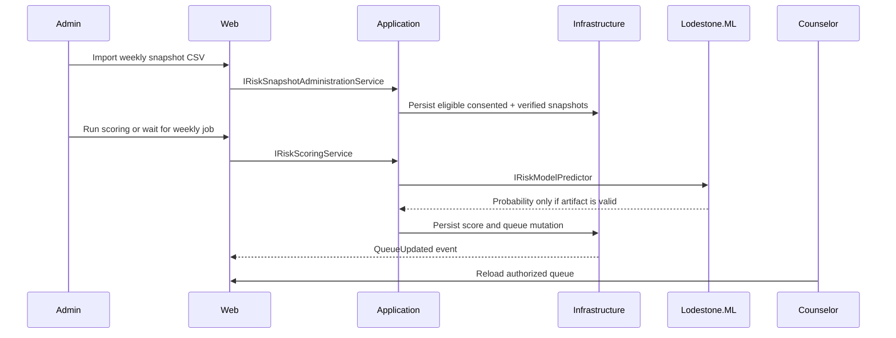

# Architecture

## Overview

Lodestone uses Clean Architecture. Domain and Application hold core rules and interfaces; Infrastructure, ML, Jobs, and Web implement outer concerns.

## Runtime ML Flow

`IRiskModelPredictor` is Application-owned, so ML.NET stays outside the inner layers. The Web app composes the implementation and exposes health/status without leaking artifact paths.

## Fail-Closed Behavior

When ML is disabled, the app reports an intentional disabled state and does not score. When ML is enabled but artifacts are missing, corrupt, hash-invalid, schema-invalid, version-invalid, gate-invalid, or unloadable, `/health/ml` and readiness become unhealthy and scoring is blocked.

## Privacy Architecture

Risk monitoring requires active consent and Admin-verified student number mapping at import time and again at scoring/persistence time. Consent withdrawal deletes derived monitoring data. Students can see their consent and verification state, but never risk probabilities or queue records.
