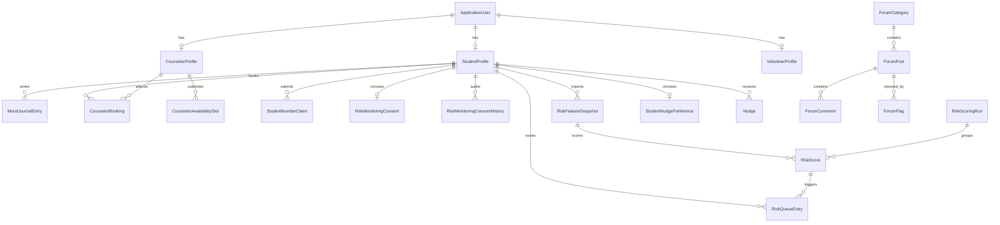

# ER Diagram

This is a simplified view of the current EF Core model around the implemented wellbeing and risk workflows.

Key constraints:

- Student-number claims are reviewed before `StudentProfile.StudentNumber` becomes trusted.
- Risk snapshots are unique by student, course, window, and schema.
- Scores are unique by snapshot and model version.
- Open queue cases are constrained to one per student.
- Manual nudges require explicit in-app preference and are independent from ML risk monitoring.
