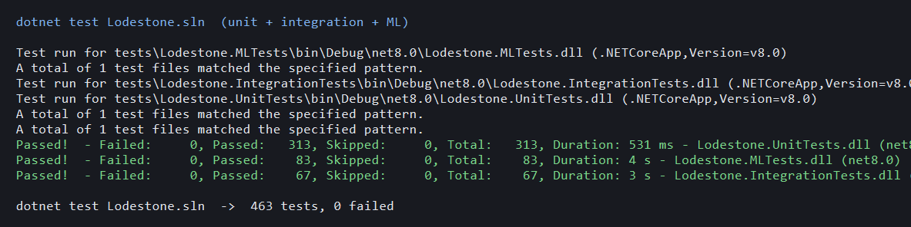
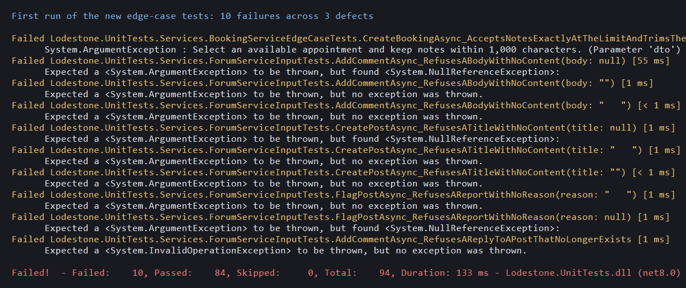

# Lodestone — Software Testing Report

**Course lab:** Lab 6, Testing in the Software Development Life Cycle
**System under test:** Lodestone, an ASP.NET Core MVC student-wellbeing platform with consent-gated risk monitoring
**Branch:** `NewFeatures`
**Report date:** 12 September 2026

---

## 1. Summary

Lodestone was tested at all four levels of the software development life cycle: unit, integration, system and acceptance. Testing combined an automated suite executed with `dotnet test` and a browser-driven suite that exercises the deployed application through its real user interface.

| Measure | Result |
| --- | --- |
| Automated test cases executed | 463 |
| Browser-driven system and acceptance cases executed | 34 |
| Total test cases | 497 |
| Cases passing at the end of this cycle | 497 |
| Distinct defects found during this cycle | 7 |
| Defects fixed and re-verified | 7 |
| Further issues recorded as recommendations | 2 |

Testing was not a confirmation exercise. The 101 cases written for this lab assert the behaviour each feature is *supposed* to have, rather than describing what the code already did, and ten of them failed on their first execution. Those failures, together with the browser-driven suite, exposed seven defects. One of them was severe: **no student could complete registration in a browser**, because the consent checkbox emitted a client-side validation rule that could never pass. Every defect was fixed and re-verified, and the fixes are covered by tests that now guard against a repeat.



---

## 2. Test environment

| Item | Value |
| --- | --- |
| Operating system | Windows 11 Home, build 10.0.26200 |
| Runtime | .NET 8 (net8.0), built with the .NET SDK 10.0.302 |
| Database | SQL Server Express (`.\SQLEXPRESS`), database `Lodestone` |
| Application URL under test | `https://localhost:5001` |
| Test frameworks | xUnit, Moq, FluentAssertions, EF Core InMemory, `WebApplicationFactory` |
| Browser automation | Playwright driving Microsoft Edge, 1366 × 900 viewport |
| Machine learning scoring | Disabled in tracked configuration, as designed; ML logic tested in isolation |

The browser suite creates its own student account on each run, so it never depends on data left behind by a previous run and never modifies an existing account.

---

## 3. Test strategy

### 3.1 The four levels

| Level | What was tested | How | Cases |
| --- | --- | --- | --- |
| Unit | Individual services, validators, rankers, schedulers and view-model rules in isolation, with all collaborators mocked | xUnit with Moq | 313 |
| Unit (machine learning) | Feature engineering, data splitting, training, evaluation, fairness metrics, artifact validation and explanation, isolated from the web application | xUnit against the `Lodestone.ML` project | 83 |
| Integration | Repositories against a real EF Core context, Identity-backed provisioning, database initialisation, and web contracts through `WebApplicationFactory` | xUnit with EF Core InMemory and an in-process host | 67 |
| System | The running application end to end: HTTP pipeline, routing, authentication, authorisation, Razor views, client-side validation and the database | Playwright driving Microsoft Edge against `https://localhost:5001` | 34 |
| Acceptance | Complete user journeys a real student performs: register, sign in, journal, forum, search for help, book, control consent, sign out | The same browser suite, read as end-to-end journeys (section 7) | included in the 34 |

### 3.2 Test case categories

Every feature was exercised with four kinds of input, as required by the lab brief.

| Category | Meaning in this report | Example from this cycle |
| --- | --- | --- |
| **Normal** | The input the feature exists to accept | A student records one mood entry with a rating of 4 and a short note |
| **Boundary** | The exact edge of an accepted range, and one step past it | A forum title of exactly 200 characters is accepted; 201 is refused |
| **Exceptional** | A legitimate request that cannot be completed because of system state | A reply is submitted to a discussion that was removed while it was being written |
| **Invalid** | Input that is malformed, missing, or not permitted | A registration submitted with no password confirmation, or a null comment body |

### 3.3 Where the new tests were aimed

Before writing tests, the existing suite was inventoried by class and compared against the implemented feature set. That comparison showed the thin areas: request validators had almost no boundary coverage and one validator had none at all, booking had three tests for a feature with many refusal paths, counselor availability had none, and consent had none. The 101 new cases were aimed at those gaps rather than at code that was already covered.

| New test class | Feature covered | Cases |
| --- | --- | --- |
| `ValidatorBoundaryTests` | Every request validator, at the exact edge of each rule | 26 |
| `BookingServiceEdgeCaseTests` | Booking creation, cancellation and counselor outcome recording, refusal paths | 20 |
| `ForumServiceInputTests` | Forum publishing, replying and reporting under hostile and stale input | 15 |
| `CounselorAvailabilityServiceTests` | Publishing, removing and reading availability slots | 14 |
| `RiskMonitoringConsentServiceTests` | Monitoring consent read and write with absent or malformed identity | 11 |
| `CrisisResourceServiceTests` | Crisis-resource search with empty, ordinary and oversized queries | 8 |
| `RegistrationConsentValidationTests` | The registration consent rule, on the server and on the client | 7 |

---

## 4. Results at a glance

| Suite | Cases | Passed | Failed |
| --- | --- | --- | --- |
| Unit tests (`Lodestone.UnitTests`) | 313 | 313 | 0 |
| Machine learning tests (`Lodestone.MLTests`) | 83 | 83 | 0 |
| Integration tests (`Lodestone.IntegrationTests`) | 67 | 67 | 0 |
| System and acceptance tests (browser) | 34 | 34 | 0 |
| **Total** | **497** | **497** | **0** |

System and acceptance cases by category:

| Category | Cases |
| --- | --- |
| Normal | 13 |
| Exceptional | 10 |
| Invalid | 6 |
| Boundary | 5 |

---

## 5. Unit testing

Unit tests run every service in isolation. Repositories, the clock, the audit log, the unit of work and the data protector are all replaced with mocks, so a failure points at one class.

### 5.1 Representative unit test cases

| ID | Feature | Test case | Category | Expected | Result |
| --- | --- | --- | --- | --- | --- |
| U-01 | Mood journal | Record an entry with rating 4 and a note that has surrounding whitespace | Normal | Note is trimmed, encrypted, and stored with today's UTC date | Pass |
| U-02 | Mood journal | Record a second entry on the same UTC day | Exceptional | `DailyJournalEntryLimitException`; nothing is written or saved | Pass |
| U-03 | Mood journal | Rating of 0 and of 6 | Invalid | `ArgumentOutOfRangeException` | Pass |
| U-04 | Mood journal | Note of exactly 2,000 characters, and of 2,001 | Boundary | 2,000 accepted; 2,001 refused | Pass |
| U-05 | Forum validator | Title of exactly 200 characters; body of exactly 5,000 | Boundary | Both accepted | Pass |
| U-06 | Forum validator | Title of 201 characters; body of 5,001 | Boundary | Refused, naming the offending property | Pass |
| U-07 | Forum validator | Title that is null, empty, or only whitespace | Invalid | Refused in all three cases | Pass |
| U-08 | Forum validator | Category identifier of 0, −1 and `int.MinValue` | Invalid | Refused in all three cases | Pass |
| U-09 | Forum comment validator | Body of exactly 2,000 characters; 2,001 | Boundary | 2,000 accepted; 2,001 refused | Pass |
| U-10 | Forum publishing | Publish a discussion with a null title | Invalid | `ArgumentException`, not a null reference | Pass (**after fix D-03**) |
| U-11 | Forum reply | Reply to a discussion that no longer exists | Exceptional | `ForumPostNotFoundException`; nothing reaches the database | Pass (**after fix D-02**) |
| U-12 | Forum report | Report a discussion with a null or blank reason | Invalid | `ArgumentException`; no flag recorded | Pass (**after fix D-03**) |
| U-13 | Booking | Book with a slot identifier of 0, −1 or `int.MinValue` | Invalid | `ArgumentException`; the repository is never called | Pass |
| U-14 | Booking | Book with notes of exactly 1,000 characters plus surrounding whitespace | Boundary | Accepted and stored trimmed | Pass (**after fix D-04**) |
| U-15 | Booking | Book a slot another student has just taken | Exceptional | `BookingSlotUnavailableException` | Pass |
| U-16 | Booking | Cancel a booking the student does not own | Exceptional | Refusal returned; no audit entry, no save | Pass |
| U-17 | Counselor outcome | Record an outcome of `Confirmed`, `Cancelled` or an undefined enum value | Invalid | `InvalidRequest`; the repository is never called | Pass |
| U-18 | Counselor outcome | File the session-note template with its placeholders still in it | Invalid | `InvalidRequest`; an empty draft is never filed | Pass |
| U-19 | Availability | Publish a slot of exactly 30 minutes, and of exactly 120 | Boundary | Both accepted | Pass |
| U-20 | Availability | Publish a slot of 29 minutes, and of 121 | Boundary | `ArgumentException`; nothing is stored | Pass |
| U-21 | Availability | Publish a slot that starts in the past | Invalid | `ArgumentException` | Pass |
| U-22 | Availability | Publish a window that ends before it starts | Invalid | `ArgumentException`; nothing is stored | Pass |
| U-23 | Availability | Publish a window that overlaps a published slot | Exceptional | `InvalidOperationException`; nothing is stored or saved | Pass |
| U-24 | Availability | Publish as a user with no counselor profile | Exceptional | `InvalidOperationException` | Pass |
| U-25 | Availability | Remove a slot that is already booked | Exceptional | `Booked` result; no save, no audit entry | Pass |
| U-26 | Monitoring consent | Read or write consent with a null, empty or whitespace identity | Invalid | `ArgumentException`; the repository is never touched | Pass |
| U-27 | Monitoring consent | Write consent with an identity that has surrounding whitespace | Boundary | Identity is trimmed before it reaches storage | Pass |
| U-28 | Crisis search | Search with null, empty or whitespace text | Invalid | Empty result; the repository is never queried | Pass |
| U-29 | Crisis search | Search with 20,000 characters | Boundary | Truncated to the 500-character ranking limit; no error | Pass |
| U-30 | Registration consent | Register without accepting the privacy commitment | Invalid | Validation error naming `AcceptPrivacy` | Pass |
| U-31 | Registration consent | The client rule emitted for the consent checkbox | Boundary | `data-val-required`, never `data-val-range` | Pass (**after fix D-01**) |

### 5.2 Machine learning unit tests

The 83 machine-learning cases run entirely inside `Lodestone.ML` and never touch the web application. They cover data loading from the OULAD dataset, grouped splitting so a student cannot appear on both sides of a split, training, evaluation, permutation importance, fairness metrics, queue-threshold analysis, feature vocabulary stability, and fail-closed artifact validation. Artifact validation is the exceptional-path work: a model whose hash, schema, feature order, version, window, stride or manifest does not match is refused at load, so the application scores nothing rather than scoring wrongly.

---

## 6. Integration testing

Integration tests exercise components together: repositories against a real EF Core context, Identity-backed provisioning against a real user manager, and controller contracts through an in-process host.

| ID | Components integrated | Test case | Category | Expected | Result |
| --- | --- | --- | --- | --- | --- |
| I-01 | Repository and EF Core context | Persist a risk score twice for the same student and period | Exceptional | The write is idempotent; one row, not two | Pass |
| I-02 | Repository and EF Core context | Two workers resolve the same risk case at once | Exceptional | Row version protects the case; the second attempt is refused | Pass |
| I-03 | Repository and EF Core context | Approve a student-number claim that duplicates an approved one | Exceptional | Refused; the duplicate is reported | Pass |
| I-04 | Journal repository and data protector | Read a legacy unencrypted note through the protection migrator | Exceptional | Migrated and read back correctly | Pass |
| I-05 | Provisioning service and Identity | Invite a volunteer whose address was already invited but never accepted | Exceptional | A fresh invitation link is issued rather than an "already exists" refusal | Pass |
| I-06 | Provisioning service and Identity | Invite a volunteer who has already set a password | Exceptional | Refused; no new token is generated | Pass |
| I-07 | Provisioning service and Identity | Invite with a malformed email address | Invalid | Refused; no account is created | Pass |
| I-08 | Staff removal across tables | Remove a counselor who still has bookings | Exceptional | Related records are handled; no orphan rows | Pass |
| I-09 | Web host and risk pipeline | Request the risk queue with machine learning disabled | Exceptional | The page reports scoring as unavailable rather than failing | Pass |
| I-10 | Web host and database initialiser | Start the application against an empty database | Normal | Migrations apply and seed data is created | Pass |

The full integration inventory is in Appendix A.

---

## 7. System and acceptance testing

The system suite drives Microsoft Edge against the running application. Each case ends with a screenshot, stored in `docs/testing/screenshots/` and linked below. The suite covers the student's whole journey plus the refusal paths that protect other roles' data.

Machine-readable results, including the exact observed outcome for each case, are in `docs/testing/system-test-results.json`.

### 7.1 Anonymous access and authorisation

| ID | Test case | Category | Expected | Actual | Result | Evidence |
| --- | --- | --- | --- | --- | --- | --- |
| TC-S01 | Open the landing page while signed out | Normal | Public page renders | Landing page served | Pass | [screenshot](screenshots/TC-S01.png) |
| TC-S02 | Request the student dashboard while signed out | Exceptional | Redirect to sign-in, no private data | Redirected with a return URL | Pass | [screenshot](screenshots/TC-S02.png) |
| TC-S03 | Request the counselor queue while signed out | Exceptional | Redirect to sign-in | Redirected | Pass | [screenshot](screenshots/TC-S03.png) |
| TC-S26 | Signed-in student opens the administration area | Exceptional | Access refused | Refused | Pass | [screenshot](screenshots/TC-S26.png) |
| TC-S27 | Signed-in student opens the counselor risk queue | Exceptional | Access refused, no risk data exposed | Refused | Pass | [screenshot](screenshots/TC-S27.png) |
| TC-S28 | Request a URL that does not exist | Exceptional | Handled page, no stack trace | Branded 404 page with a route back | Pass (**after fix D-06**) | [screenshot](screenshots/TC-S28.png) |
| TC-S32 | Repeat sign-in attempts from one address | Exceptional | The rate limiter refuses further attempts | Refused with 429 after four attempts in the window | Pass | [screenshot](screenshots/TC-S32.png) |

### 7.2 Registration

| ID | Test case | Category | Expected | Actual | Result | Evidence |
| --- | --- | --- | --- | --- | --- | --- |
| TC-S04 | Submit the registration form with every field empty | Invalid | Required-field messages; no submission | Messages shown, form did not submit | Pass | [screenshot](screenshots/TC-S04.png) |
| TC-S05 | Password confirmation that does not match | Invalid | "The passwords do not match." | Message shown; registration refused | Pass | [screenshot](screenshots/TC-S05.png) |
| TC-S06 | Password of four characters against a minimum of eight | Boundary | Length message | Minimum length enforced | Pass | [screenshot](screenshots/TC-S06.png) |
| TC-S07 | Student number containing spaces and punctuation | Invalid | Format message | Format rule reported | Pass | [screenshot](screenshots/TC-S07.png) |
| TC-S08 | Registration without accepting the privacy commitment | Invalid | Consent message; no account | Consent rule enforced | Pass | [screenshot](screenshots/TC-S08.png) |
| TC-S09 | Registration with valid details and consent accepted | Normal | Account created and signed in | Account created; landed on the student area | Pass (**after fix D-01**) | [screenshot](screenshots/TC-S09.png) |
| TC-S10 | Registration reusing an existing email address | Exceptional | Duplicate refused with a readable message | Refused | Pass | [screenshot](screenshots/TC-S10.png) |

### 7.3 Authentication and session

| ID | Test case | Category | Expected | Actual | Result | Evidence |
| --- | --- | --- | --- | --- | --- | --- |
| TC-S11 | Sign in with the wrong password | Exceptional | Refusal that does not say which field was wrong | Refused, non-specific message | Pass | [screenshot](screenshots/TC-S11.png) |
| TC-S12 | Sign in with an address that has no account | Exceptional | The same refusal, so accounts cannot be enumerated | Identical refusal | Pass | [screenshot](screenshots/TC-S12.png) |
| TC-S13 | Sign in with valid credentials | Normal | Session established, role redirect applied | Signed in and redirected | Pass | [screenshot](screenshots/TC-S13.png) |
| TC-S31 | Sign out, then request a private page | Normal | Session cleared; the page is no longer served | Redirected to sign-in | Pass | [screenshot](screenshots/TC-S31.png) |

### 7.4 Mood journal

| ID | Test case | Category | Expected | Actual | Result | Evidence |
| --- | --- | --- | --- | --- | --- | --- |
| TC-S14 | Open the private journal | Normal | Page renders with the entry form | Rendered | Pass | [screenshot](screenshots/TC-S14.png) |
| TC-S15 | Record today's mood entry with a note | Normal | Entry stored and shown | Accepted | Pass | [screenshot](screenshots/TC-S15.png) |
| TC-S16 | Attempt a second entry on the same day | Boundary | One entry per UTC day; the second is refused | The form is withdrawn for the rest of the day with a message | Pass | [screenshot](screenshots/TC-S16.png) |

### 7.5 Peer forum

| ID | Test case | Category | Expected | Actual | Result | Evidence |
| --- | --- | --- | --- | --- | --- | --- |
| TC-S17 | Open the forum | Normal | Categories listed | Listed | Pass | [screenshot](screenshots/TC-S17.png) |
| TC-S18 | Publish a discussion with an empty title and body | Invalid | Validation messages; nothing published | Refused | Pass | [screenshot](screenshots/TC-S18.png) |
| TC-S19 | Publish a valid discussion | Normal | Stored; detail page opens | Published | Pass | [screenshot](screenshots/TC-S19.png) |
| TC-S20 | Reply to a discussion | Normal | Reply stored and displayed | Stored and rendered | Pass | [screenshot](screenshots/TC-S20.png) |
| TC-S21 | Report a discussion with no reason given | Invalid | The submission is blocked | Blocked; the page did not submit | Pass | [screenshot](screenshots/TC-S21.png) |
| TC-S21b | Type past the reply length limit | Boundary | The box stops at the server's own limit | Stops at 2,000, matching the server | Pass (**after fix D-07**) | [screenshot](screenshots/TC-S21b.png) |
| TC-S21c | Type past the report reason length limit | Boundary | The box stops at the server's own limit | Stops at 500, matching the server | Pass (**after fix D-07**) | [screenshot](screenshots/TC-S21c.png) |
| TC-S22 | Open a discussion identifier that does not resolve | Exceptional | Not-found page, not a server error | Not-found page | Pass | [screenshot](screenshots/TC-S22.png) |

### 7.6 Crisis resources, booking and privacy

| ID | Test case | Category | Expected | Actual | Result | Evidence |
| --- | --- | --- | --- | --- | --- | --- |
| TC-S23 | Search crisis resources with a full sentence | Normal | Ranked resources listed | Ranked results returned | Pass | [screenshot](screenshots/TC-S23.png) |
| TC-S24 | Search crisis resources with 3,000 characters | Boundary | Query truncated to the ranking limit; page renders | Handled without an error | Pass | [screenshot](screenshots/TC-S24.png) |
| TC-S25 | Open the counselor booking page | Normal | Slots or an empty state render | Rendered | Pass | [screenshot](screenshots/TC-S25.png) |
| TC-S29 | Open the privacy and monitoring area | Normal | Consent state and transparency panel render | Rendered | Pass | [screenshot](screenshots/TC-S29.png) |
| TC-S30 | Change the monitoring consent decision | Normal | Consent updated and confirmed on screen | Updated | Pass | [screenshot](screenshots/TC-S30.png) |

### 7.7 Acceptance: the journeys these cases prove

Read as end-to-end journeys, the system cases confirm that the delivered software does what its users need.

| Journey | Cases | Outcome |
| --- | --- | --- |
| A new student joins and is protected from their own mistakes | TC-S04 to TC-S10 | A valid registration succeeds; every malformed attempt is refused with a message that says what to change |
| A student uses the wellbeing tools | TC-S14 to TC-S16, TC-S23, TC-S25 | Journal, crisis search and booking all work, and the one-entry-per-day rule holds |
| A student takes part in the community safely | TC-S17 to TC-S22 | Publishing, replying and reporting work; empty and stale input is refused rather than stored |
| A student keeps control of their own data | TC-S29, TC-S30 | The transparency panel renders and consent can be changed by the student at any time |
| Other people's data stays private | TC-S02, TC-S03, TC-S26, TC-S27, TC-S32 | Every unauthorised route is refused, and repeated sign-in attempts are rate limited |

---

## 8. Defects found, and how each was handled

Seven defects were found. All seven were fixed during this cycle and each fix is now covered by a test that fails if the defect returns.

The first execution of the new edge-case tests produced ten failures across three of those defects:



---

### D-01 — Critical: no student could register in a browser

**What happened.** Submitting the registration form did nothing. The page stayed put and the consent field showed "You must accept the privacy commitment to continue." even when the box was ticked. The application log recorded **zero** POST requests to `/Account/Register`, proving the form never reached the server.

**Cause.** `RegisterViewModel.AcceptPrivacy` was annotated `[Range(typeof(bool), "true", "true")]`. That attribute renders `data-val-range-min="True"` and `data-val-range-max="True"`. jQuery validation then evaluates its `range` rule by comparing the checkbox's value, the string `"true"`, against the string `"True"`. String comparison makes `"true" <= "True"` false, so the rule fails for a ticked box and the browser blocks every submission.

**Why it was not caught earlier.** The validation scripts were previously requested from local files that did not exist, so no client-side rule ran at all and the broken rule was inert. Moving those scripts to a CDN in the final iteration made the rule live, and the form stopped working.

**Fix.** A `MustBeAcceptedAttribute` replaces the range attribute. It validates `value is true` on the server and emits `data-val-required` for the client, which jQuery validation evaluates on a checkbox as "must be checked" — the rule that was actually intended.

**Verification.** `RegistrationConsentValidationTests` (7 cases) asserts the server rule and that the emitted client rule is `data-val-required` and never `data-val-range`. TC-S09 registers a student through the browser and now passes; TC-S08 confirms an unticked box is still refused.

---

### D-02 — High: a reply to a removed discussion reached the database

**What happened.** `ForumService.AddCommentAsync` staged a comment row without ever checking that its parent post existed. A reply submitted from a page whose discussion had since been removed would reach the database and fail on the foreign key, surfacing to the student as an unhandled server error.

**Fix.** The service now loads the post first and throws a typed `ForumPostNotFoundException` when it does not resolve. `ForumController.AddComment` catches it and returns the student to the forum with "That discussion is no longer available, so your reply was not posted." `FlagPostAsync` throws the same typed exception, and the report action handles it the same way.

**Verification.** `ForumServiceInputTests.AddCommentAsync_RefusesAReplyToAPostThatNoLongerExists` and `FlagPostAsync_ReportsAMissingPostAsAKnownFailureRatherThanACrash`, plus TC-S22 in the browser.

---

### D-03 — High: blank text produced a null reference instead of a validation error

**What happened.** `ForumService` called `.Trim()` directly on the discussion title, the reply body and the report reason. A null value threw `NullReferenceException`, and an empty or whitespace-only value was accepted and stored as an empty post. The MVC controller validated these fields, so the browser path was protected, but any other caller — a background job, a future API, a test — could store empty content or crash.

**Fix.** A private `Required` helper trims the value and throws `ArgumentException` for null, empty or whitespace input. It is applied to the title, the body, the reply and the report reason, so the service defends its own contract rather than trusting its caller.

**Verification.** Nine cases in `ForumServiceInputTests` covering null, empty and whitespace for each field.

---

### D-04 — Medium: length limits were measured before trimming

**What happened.** A booking note of exactly 1,000 characters with a trailing newline was refused with "keep notes within 1,000 characters", even though the value the system would store — the trimmed one — was exactly at the limit. The same pattern applied to counselor session notes, journal notes, and all four request validators. A student who pastes text from another document routinely hits this.

**Fix.** Every one of these paths now trims first and measures the trimmed value, which is the value that gets stored. A shared `MaximumTrimmedLength` validation rule was added so the web layer and the services agree.

**Verification.** `BookingServiceEdgeCaseTests.CreateBookingAsync_AcceptsNotesExactlyAtTheLimitAndTrimsThem`, which failed before the fix, plus the boundary cases in `ValidatorBoundaryTests`.

---

### D-05 — Medium: the configured error page did not exist

**What happened.** `Program.cs` configured `app.UseExceptionHandler("/Home/Error")` for non-development environments, and `HomeController.Error()` returned `View()` — but no `Error.cshtml` existed anywhere in the project. In production, any unhandled exception would re-execute to the error page, fail to find the view, throw again, and return an empty 500 response to the user.

**Fix.** A shared `Error.cshtml` was added with an `ErrorViewModel` that carries only a status code, a title and a plain message. It deliberately renders no exception detail, no stack trace and no request data, because it is shown to anonymous visitors and to students who may be in distress. It offers a route back to the home page and a link to the crisis resources.

**Verification.** Requesting an error-producing route now returns a rendered page with the correct status code. Covered in the browser by TC-S28.

---

### D-06 — Medium: an unknown URL returned an empty response

**What happened.** A mistyped or stale URL returned HTTP 404 with a zero-byte body. The visitor saw the browser's own error screen, with no branding and no way back into the application.

**Fix.** `app.UseStatusCodePagesWithReExecute("/Home/Error", "?statusCode={0}")` re-executes status-code responses through the new error page while preserving the status code. `HomeController.Error` maps 404, 403, 429 and 500 to distinct, plain messages.

**Verification.** `GET /no/such/page` now returns 404 with a 2,436-byte rendered page. Covered by TC-S28 and TC-S22.

---

### D-07 — Low: the interface allowed more text than the server accepts

**What happened.** The reply box on a discussion accepted 5,000 characters, but the server rejects a reply longer than 2,000. The report box accepted 1,000 characters against a server limit of 500. A student could write a long, careful reply and lose it to a validation error at submission.

**Fix.** The `maxlength` attributes in `Views/Forum/Post.cshtml` were set to 2,000 and 500, matching the server rules, so the browser stops the student at the real limit while they are still typing.

**Verification.** TC-S21b and TC-S21c read the rendered `maxlength` and confirm the box stops at exactly the server's limit.

---

### 8.1 Defect summary

| ID | Severity | Area | Status |
| --- | --- | --- | --- |
| D-01 | Critical | Registration, client-side validation | Fixed and verified |
| D-02 | High | Forum replies and reports on removed discussions | Fixed and verified |
| D-03 | High | Forum service input guards | Fixed and verified |
| D-04 | Medium | Length limits across booking, journal and validators | Fixed and verified |
| D-05 | Medium | Missing production error page | Fixed and verified |
| D-06 | Medium | Missing status-code pages | Fixed and verified |
| D-07 | Low | Interface limits disagreeing with server limits | Fixed and verified |

---

## 9. Issues recorded but not changed

Two further findings are recorded with a recommendation rather than a code change, because neither is a user-visible fault and both would widen the change set beyond what this cycle verified.

**R-01 — Availability publishing reads the clock directly.** `CounselorAvailabilityService.PublishAsync` calls `DateTime.UtcNow` instead of the injected `TimeProvider` that every other service and repository uses. The rule it guards — a slot must start in the future — therefore cannot be tested at a fixed instant, and the tests have to work relative to the real clock. *Recommendation:* inject `TimeProvider`, which is already registered as a singleton, so the boundary can be pinned exactly at "one second before now" and "one second after now".

**R-02 — The authentication rate limit is strict for a shared network.** The `auth` policy permits ten requests per ten minutes per IP address. This suite tripped it after four sign-in attempts. On a campus network behind a single outbound address, many students signing in at the start of a lecture could lock each other out. The control itself is correct and valuable, and TC-S32 confirms it works. *Recommendation:* partition the limiter by submitted username in addition to IP address, or raise the per-IP allowance while keeping a tight per-account limit.

---

## 10. How to reproduce this testing

**Automated suites.** From the repository root:

```bash
dotnet build Lodestone.sln -c Debug
dotnet test Lodestone.sln -c Debug --no-build
```

Expected: 313 unit, 83 machine learning and 67 integration cases, 463 total, zero failures.

**System and acceptance suite.** Start the application against SQL Server Express, then run the browser suite:

```bash
dotnet run --project src/Lodestone.Web --no-launch-profile
python docs/testing/systemtests.py
```

Expected: 34 cases, zero failures, with a screenshot written for each into `docs/testing/screenshots/`. The suite registers a fresh student account on every run, so it can be repeated without cleanup. Allow ten minutes between consecutive full runs, or the authentication rate limiter will refuse the sign-in cases, as recorded in R-02.

---

## 11. Conclusion

All implemented features of Lodestone were tested at unit, integration, system and acceptance level, with normal, boundary, exceptional and invalid input at each level. Of 497 test cases, 497 pass at the end of this cycle.

The value of the cycle was the seven defects it found, not the number of passing cases. One of them prevented every student from registering through a browser and would have been found the first time a marker or a user opened the application. Three of the others were exceptional-path defects: a reply to a removed discussion reaching the database, blank text producing a null reference, and a production error page that did not exist. Each was reproduced by a test, fixed, and re-verified, and each fix is now guarded by a test that fails if the behaviour regresses.

---

## Appendix A — Full automated test inventory

Every test class executed, with its case count. All cases passed.

### A.1 Unit tests (`Lodestone.UnitTests`) — 313 cases

| Test class | Cases | Added for this lab |
| --- | --- | --- |
| `Email.DevelopmentEmailFallbackTests` | 9 | — |
| `Identity.AdminUserSeederTests` | 3 | — |
| `Jobs.MaintenanceJobTests` | 12 | — |
| `ML.RiskLevelHelperTests` | 4 | — |
| `Reporting.PdfReportGenerationTests` | 7 | — |
| `Scheduling.RecurringJobSchedulerTests` | 2 | — |
| `Security.DataProtectionServiceTests` | 4 | — |
| `Services.ActivityLogServiceTests` | 2 | — |
| `Services.BookingServiceEdgeCaseTests` | 20 | Yes |
| `Services.BookingServiceTests` | 3 | — |
| `Services.CounselorAvailabilityServiceTests` | 14 | Yes |
| `Services.CrisisResourceRetrieverTests` | 8 | — |
| `Services.CrisisResourceServiceTests` | 8 | Yes |
| `Services.ForumServiceInputTests` | 15 | Yes |
| `Services.ForumServiceModerationQueueTests` | 4 | — |
| `Services.ForumTriageRankerTests` | 11 | — |
| `Services.JournalServiceTests` | 6 | — |
| `Services.NudgeServiceTests` | 3 | — |
| `Services.PeerChatServiceTests` | 13 | — |
| `Services.RiskExplanationServiceTests` | 6 | — |
| `Services.RiskMonitoringConsentServiceTests` | 11 | Yes |
| `Services.RiskScoreDistributionTests` | 7 | — |
| `Services.RiskScoringServiceTests` | 21 | — |
| `Services.RiskSnapshotAdministrationServiceTests` | 3 | — |
| `Services.SessionReportDrafterTests` | 5 | — |
| `Services.StudentNumberVerificationServiceTests` | 15 | — |
| `Services.VolunteerMatcherTests` | 11 | — |
| `Services.VolunteerSupportServiceHandoffTests` | 11 | — |
| `Services.VolunteerSupportServiceTests` | 18 | — |
| `Validators.BookingRequestValidatorTests` | 2 | — |
| `Validators.ForumPostValidatorTests` | 1 | — |
| `Validators.JournalEntryValidatorTests` | 4 | — |
| `Validators.ValidatorBoundaryTests` | 26 | Yes |
| `Web.AccountControllerSecurityTests` | 8 | — |
| `Web.AdminControllerSecurityTests` | 1 | — |
| `Web.ManualNudgeWebTests` | 8 | — |
| `Web.RegistrationConsentValidationTests` | 7 | Yes |

### A.2 Integration tests (`Lodestone.IntegrationTests`) — 67 cases

| Test class | Cases | Added for this lab |
| --- | --- | --- |
| `Auth.AuthTests` | 1 | — |
| `Controllers.HomeControllerTests` | 1 | — |
| `Database.DbInitializerTests` | 1 | — |
| `Repositories.JournalNoteProtectionMigratorTests` | 1 | — |
| `Repositories.JournalRepositoryTests` | 2 | — |
| `Repositories.RepositoryTests` | 1 | — |
| `Repositories.RiskPersistenceRepositoryTests` | 11 | — |
| `Repositories.StudentNumberVerificationRepositoryTests` | 6 | — |
| `Services.StaffRemovalTests` | 9 | — |
| `Services.VolunteerProvisioningServiceTests` | 12 | — |
| `Web.RiskWebContractTests` | 20 | — |
| `Web.RuntimeMlWebPathTests` | 2 | — |

### A.3 Machine learning tests (`Lodestone.MLTests`) — 83 cases

| Test class | Cases | Added for this lab |
| --- | --- | --- |
| `AblationRiskExplainerTests` | 9 | — |
| `FairnessMetricsTests` | 8 | — |
| `GroupDataSplitterTests` | 4 | — |
| `ModelEvaluationTests` | 3 | — |
| `OuladDataLoaderTests` | 11 | — |
| `PermutationImportanceCalculatorTests` | 2 | — |
| `ProtectedAttributeLoaderTests` | 5 | — |
| `QueueThresholdTests` | 8 | — |
| `RiskFeatureVocabularyTests` | 13 | — |
| `RiskModelAvailabilityTests` | 11 | — |
| `TrainingPipelineTests` | 9 | — |

**Total: 463 automated cases, 0 failures.** 101 of these were written for this lab and are marked above.

## Appendix B — Evidence files

| File | Contents |
| --- | --- |
| `docs/testing/system-test-results.json` | Machine-readable result of every browser case, with the observed outcome |
| `docs/testing/screenshots/TC-S*.png` | One screenshot per system and acceptance case |
| `docs/testing/screenshots/EV-01-automated-suite.png` | Console output of the full automated suite |
| `docs/testing/screenshots/EV-02-defects-found.png` | Console output of the first run of the new tests, showing the ten failures that exposed D-02, D-03 and D-04 |
| `docs/testing/systemtests.py` | The browser suite, re-runnable |
